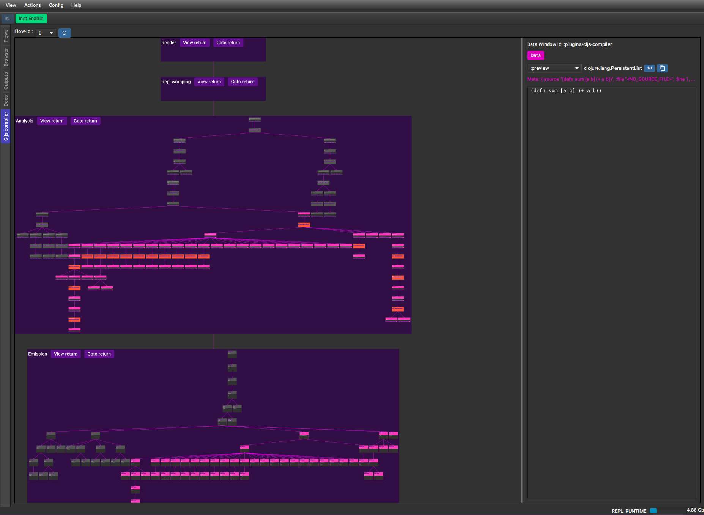
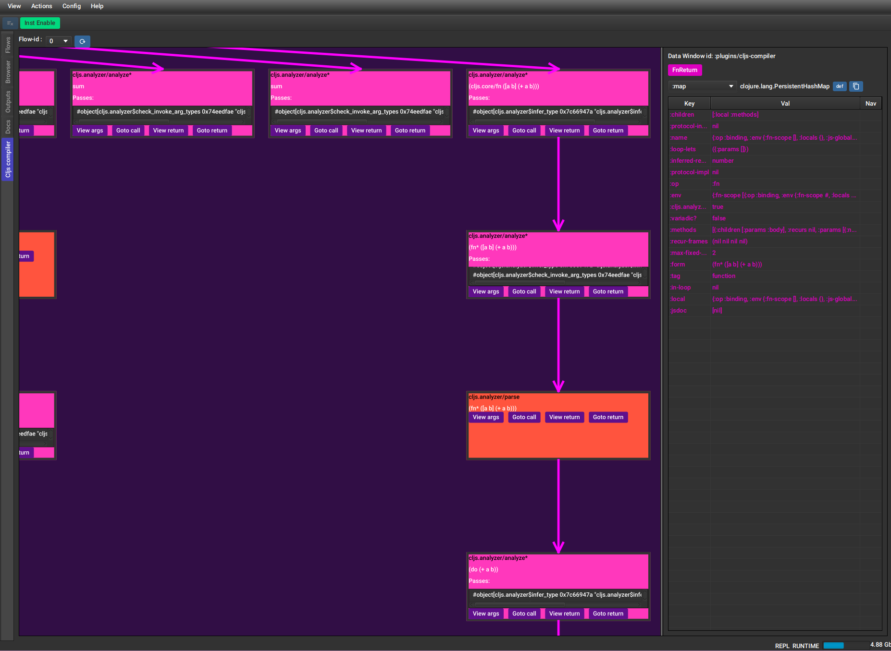
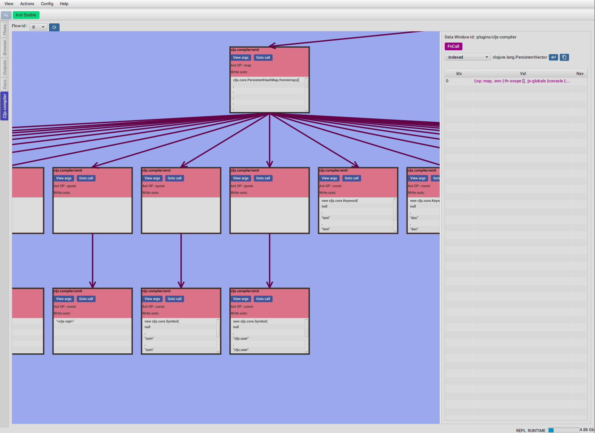

# FlowStorm ClojureScript compiler plugin





The ClojureScript compiler plugin allows you to visualize your compilings recordings.

It can help you if you are troubleshoting the compiler, developing it or just want to learn how it works. 

**Requires FlowStorm >= 4.2.0**

# Quick start

Clone the ClojureScript compiler somewhere :

```bash
git clone git@github.com:clojure/clojurescript.git
```

Add an extra alias to the deps.edn file :

```
{...
 :aliases
 {...
  :storm {:classpath-overrides {org.clojure/clojure nil}
          :extra-deps {com.github.flow-storm/flow-storm-dbg {:mvn/version "4.2.0"}
                       com.github.flow-storm/clojure {:mvn/version "1.12.0-4"}
                       com.github.flow-storm/flow-storm-cljs-compiler-plugin {:mvn/version "LATEST"}}
          :jvm-opts ["-Dvisualvm.display.name=CLJSCompiler"
                     "-Dclojure.storm.instrumentEnable=true"
                     "-Xms5000m" "-Xmx5000m"
                     "-Dflowstorm.startRecording=false"
                     "-Dclojure.storm.instrumentOnlyPrefixes=cljs."
                     "-Dflowstorm.jarEditorCommand=emacsclient -n +<<LINE>>:0 <<JAR>>/<<FILE>>"
                     "-Dflowstorm.fileEditorCommand=emacsclient -n +<<LINE>>:0 <<FILE>>"
                     "-Dflowstorm.theme=dark"
                     "-Dflowstorm.plugins.namespaces=flow-storm.plugins.cljs-compiler.all"]}}}
```
You can see the latest dependency for the plugin here [](https://clojars.org/com.github.flow-storm/flow-storm-cljs-compiler-plugin)

Start a repl with the new `:storm` alias and start the debugger UI with recording stopped (default):

```bash
$ clj -A:storm
...
user=> :dbg
```

Now convert that repl into a ClojureScript one : 

```clojure
user=> ((requiring-resolve 'cljs.main/-main) "--repl")

ClojureScript 0.0.398608251
cljs.user=> 
```

A browser window should popup, and you should now have a ClojureScript repl. Try to evaluate some 
forms to see everything is working smoothly.

# Usage

Let's say you want to understand the compilation of `(defn sum [a b] (+ a b))`.

- First start recording on the flow storm UI
- Now evaluate the form on the ClojureScript repl
- You should see the recordings poping up on the FlowStorm UI Flows tab
- You can now safely stop recording
- Go to the `ClojureScript compiler` plugin tab
- Select the flow id you recorded in (0 by default) and click the refresh button
- You should see a graph rendering like in the screenshots above

## High level overview

TOOD 

## Understanding analysis and parsing

TODO

## Understanding emission

TODO
